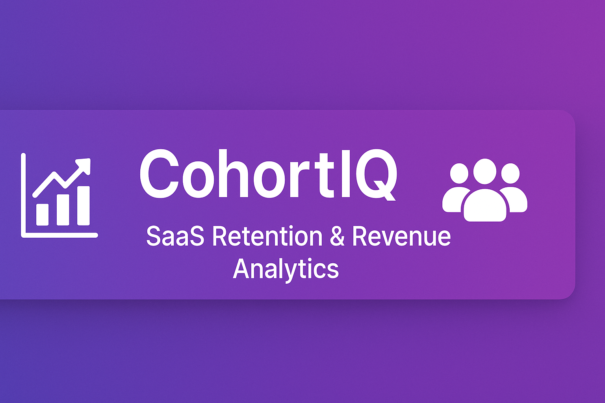
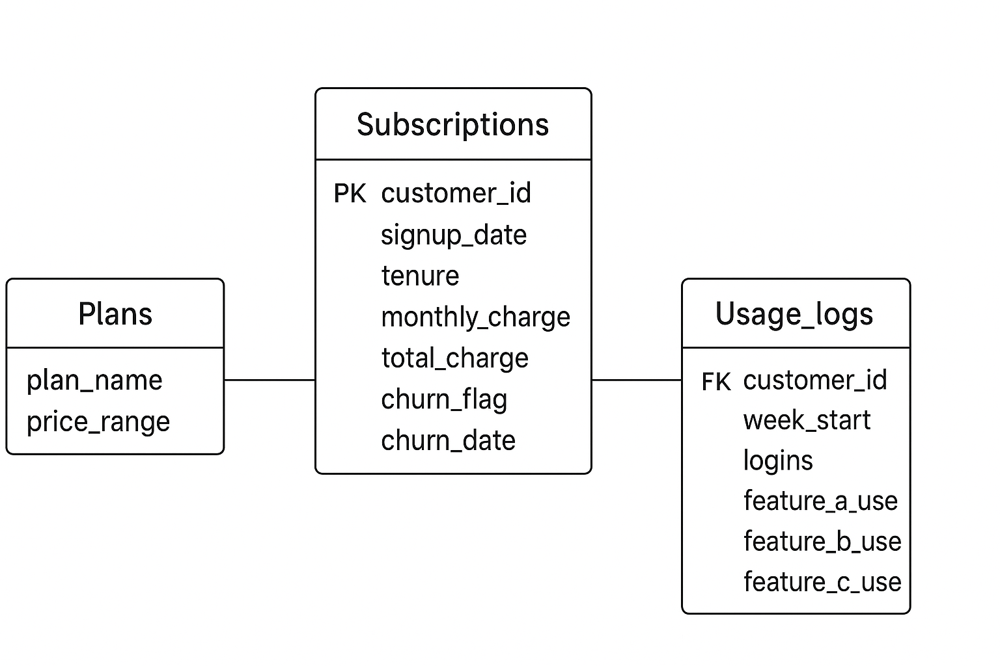

  

     

📊 **CohortIQ – SaaS Retention & Revenue Analytics**

🚀 **Overview**

**CohortIQ** is an end-to-end SaaS retention and revenue analytics project built to analyze:

- Customer churn

- Cohort retention behavior

- Feature usage patterns

- Revenue performance (ARPU, LTV)

- Customer lifecycle segmentation

The project combines **SQL, Power BI, and Python** to deliver insights that help SaaS teams understand why customers churn and how to improve retention.

🎯 **Objectives**

- Identify high-risk churn segments

- Build weekly and monthly retention cohorts

- Measure feature engagement over time

- Analyze revenue performance across subscription plans

- Build visual dashboards for business stakeholders

🧩 **Data Model (ER Diagram)**

  

🔍 **Entity Breakdown**

### 📘 Subscriptions

| **Column**      | **Description**                 |
|-----------------|---------------------------------|
| customer_id     | Primary key                     |
| signup_date     | Customer acquisition date       |
| tenure          | Number of months active         |
| monthly_charge  | Subscription fee                |
| total_charge    | Cumulative revenue              |
| churn_flag      | 1 = churned, 0 = active         |
| churn_date      | Date churn occurred             |

### 📗 Usage_logs

|**Column**      | **Description**                            |
|----------------|--------------------------------------------|
| customer_id    | Foreign key referencing subscriptions      |
| week_start     | Start date of weekly usage                 |
| logins         | Weekly login count                         |
| feature_a_use  | Engagement with Feature A                  |
| feature_b_use  | Engagement with Feature B                  |
| feature_c_use  | Engagement with Feature C                  |

### 📙 Plans

| **Column**   | **Description**    |
|--------------|--------------------|
| plan_name    | Subscription plan  |
| price_range  | Pricing tier       |

📈 **KPIs Tracked**

🧮 **Core Performance Metrics**

- Retention Rate

- Churn Rate

- Customer Lifetime Value (LTV)

- Average Revenue Per User (ARPU)

- Total Revenue

- Customer Growth Rate

🔍 **Behavioral Metrics**

- Login frequency trends

- Feature usage correlation with churn

- Engagement decay signals

💵 **Monetization Metrics**

- Revenue per plan

- Upgrade / downgrade patterns

- Plan-level profitability

📊 **Power BI Dashboards**

The Power BI report (CohortIQ_Viz.pbix) includes:

- Cohort retention heatmaps

- Churn breakdown

- RFM segmentation

- Revenue trends

- Feature adoption dashboards

- Executive summary view

The visuals are designed for product managers, data analysts, and growth teams.

🛠️ **Tech Stack**

**Languages & Tools**

**Python** – preprocessing & feature engineering

**SQL** – cohort transformations & metric computation

**Power BI** – dashboards & executive analytics

**Pandas, NumPy**

**Matplotlib / Seaborn**

📂 **Project Structure**

<pre>
CohortIQ/
│
├── data/                                # Raw and cleaned datasets
│
├── CohortIQ_Viz.pbix                    # Power BI dashboard
│
├── ER_Diagram.png                       # Entity-relationship model
├── KPIs.docx                            # KPI definitions and calculations
│
├── telco_churn.db                       # SQLite database
├── Telco_Customer_Churn.xlsx            # Customer dataset
│
├── .gitignore                           # Ignore rules for repo
├── README.md                            # Project documentation
└── LICENSE                              # MIT License
</pre>

▶️ **How to Run the Project**

1. **Clone the Repository**
git clone https://github.com/luckystar30/CohortIQ.git
cd CohortIQ

2. **View the Power BI Dashboard**

Open:

CohortIQ_Viz.pbix

3. **Explore SQL Queries**

Open the SQLite database:

telco_churn.db

Use:

- DB Browser for SQLite

- VS Code SQLite extension

4. **Run Python Processing (Optional)**

If your project includes preprocessing scripts:

pip install -r requirements.txt
python preprocess.py

📜 **License**

This project is licensed under the MIT License.
You are free to reuse, modify, and distribute this work with attribution.

See LICENSE for full text.

🤝 **Contributions**

Contributions, enhancements, and optimizations are welcome.
Feel free to submit a Pull Request or open an Issue.

⭐ **Support**

If you found this project helpful, please give the repository a star ⭐ on GitHub — it helps others discover it.
